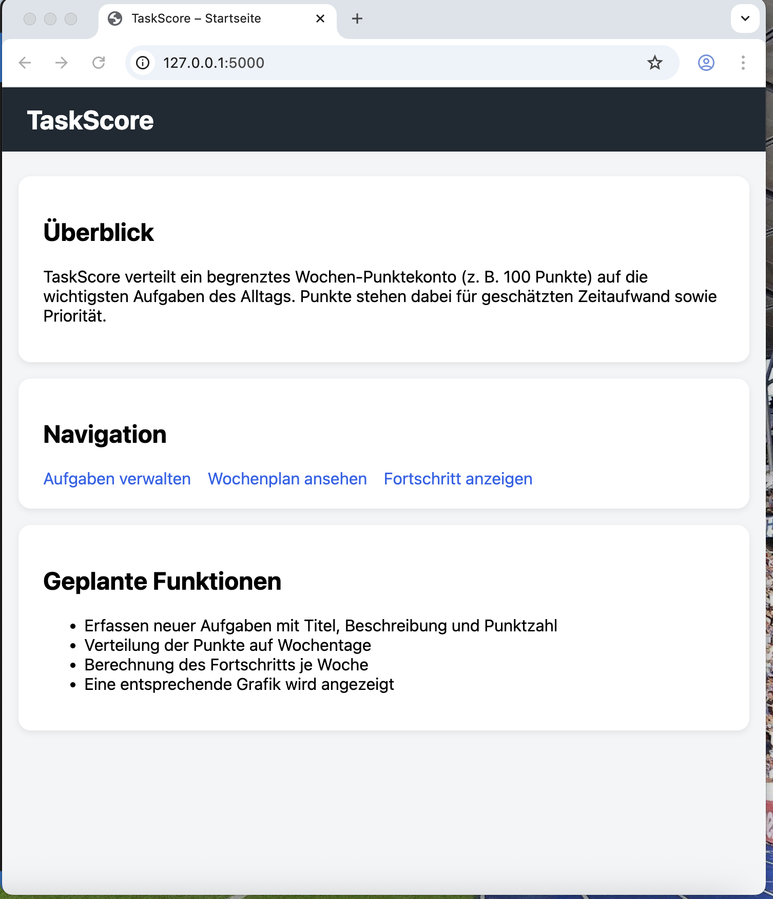
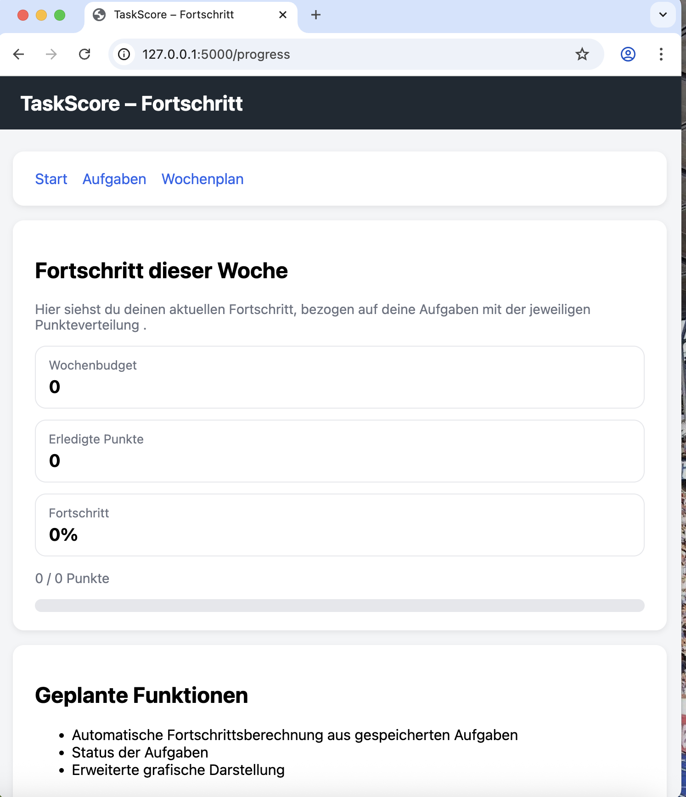

# TaskScore – Documentation Website

Diese Website dokumentiert den aktuellen Stand der Web-App **TaskScore**.
Der Fokus liegt auf der Struktur der Anwendung (UI, Datenmodell, Routing).

---

## Projektidee

TaskScore ist ein Wochen-Task-Planer mit einem festen Punktekonto
(z. B. 100 Punkte pro Woche).  
Aufgaben werden nach Zeitaufwand und Priorität bewertet.
Der Fortschritt wird visuell dargestellt.

---

## UI Screens (Current Version)

### Startseite

Die Startseite erklärt das Grundkonzept der Anwendung und bietet
Navigation zu allen Hauptansichten.

---

### Aufgabenverwaltung

In dieser Ansicht können Aufgaben geplant werden.
Jede Aufgabe besitzt:
- Titel
- Beschreibung
- Wochentag
- Punktwert

---

### Wochenplan

Der Wochenplan zeigt die geplante Punkteverteilung pro Wochentag
basierend auf einem festen Wochenbudget.

---

### Fortschritt

Diese Ansicht visualisiert den Fortschritt der Woche:
- Gesamtpunkte
- erledigte Punkte
- prozentualer Fortschritt (Grafik)

---

## Datenmodell

Das Datenmodell beschreibt die geplante Struktur zur Speicherung der
Anwendungsdaten und bildet die Grundlage für UI und Routing.

 **Vollständige Beschreibung:**  
[data-model.md](data-model.md)

---

## URL Routes / HTTP Requests

Die Anwendung ist mit Flask umgesetzt.
Jede UI-Seite wird über eine eigene URL-Route bereitgestellt.

| Route | HTTP | Beschreibung |
|------|------|-------------|
| `/` | GET | Startseite |
| `/tasks` | GET | Aufgabenverwaltung |
| `/plan` | GET | Wochenplan |
| `/progress` | GET | Fortschrittsanzeige |

Die technische Umsetzung der Routen befindet sich im
separaten **Code-Repository**.
